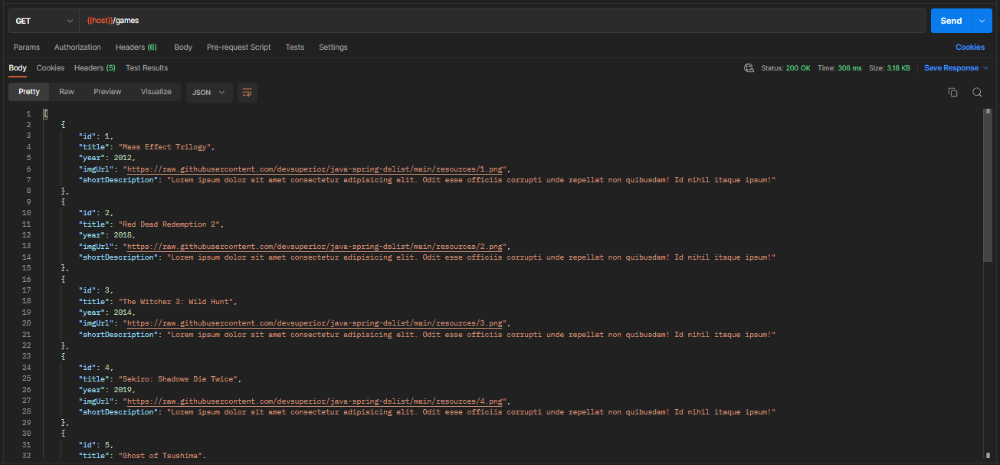
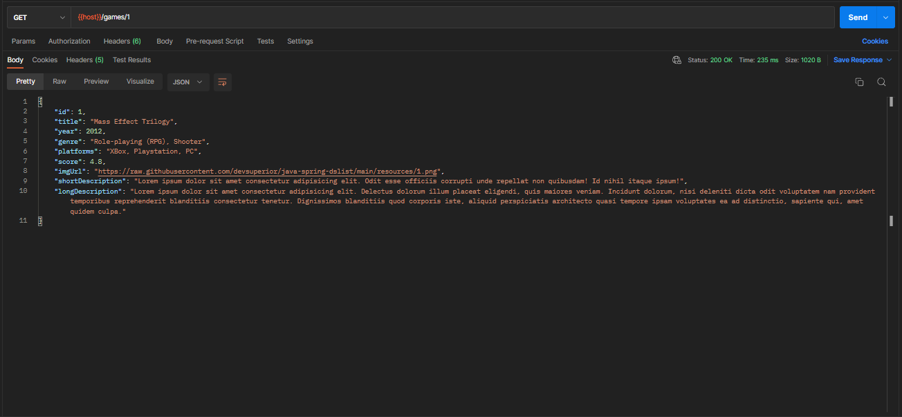
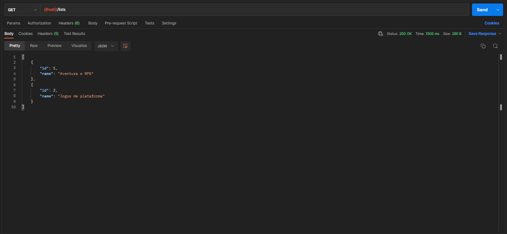
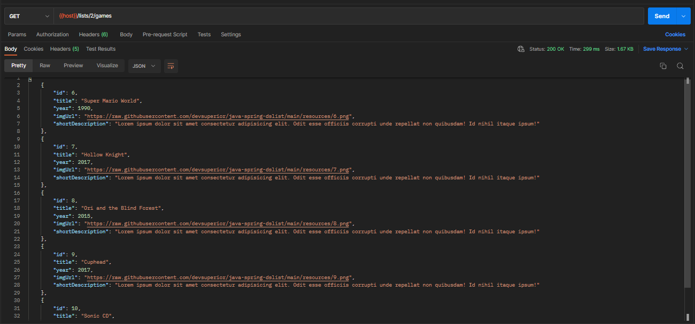
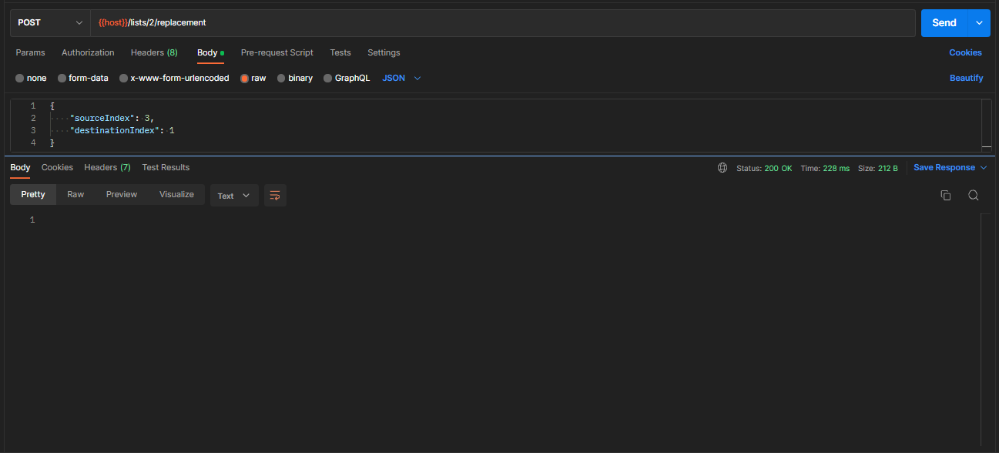

# Sobre o projeto

DSList é um sistema de coleções de jogos construído durante o treinamento gratuito: **Intensivão Java Spring**, evento organizado pelo [DevSuperior](https://devsuperior.com "Site - DevSuperior").

A aplicação DSList é um projeto backend de API que se destaca pelo uso de uma arquitetura em camadas, seguindo as melhores práticas de desenvolvimento. Com recursos de listagem com detalhes resumidos, apresentação completa dos dados dos jogos e a possibilidade de reposicionar os jogos na coleção.

# Deploy

https://dslist-production-3086.up.railway.app

### Endpoints da aplicação:

- Games: https://dslist-production-3086.up.railway.app/games

- Games by id: https://dslist-production-3086.up.railway.app/games/1

- Lista de Games: https://dslist-production-3086.up.railway.app/lists

- Games by lists: https://dslist-production-3086.up.railway.app/lists/2/games

# JSON

# Modelo conceitual

# Tecnologias utilizadas

## Back-end

- Java
- Spring Boot
- JPA / Hibernate
- Maven

## Implantação em produção

- Back-end: Railway
- Banco de dados: Postgresql

